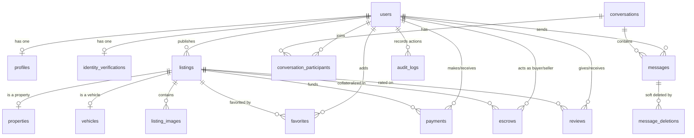

# Dalaal App: Full Project & Architectural Analysis

Dalaal is a multi-tier platform targeting the real estate and vehicle rental/sales market in Somalia and East Africa. It is designed to serve regular customers, property owners, vehicle owners, and certified brokers (*Dalaals*) with localized settings (Somali/Arabic/English support), real-time messaging, WebRTC voice/video calling, escrow support, and mobile money payments.

---

## 🏗️ 1. System Topology & Architecture

The application operates as a three-tier system:

```mermaid
graph TD
    subgraph Client Tier
        Mobile["Expo Mobile App (React Native / NativeWind)"]
        Web["Next.js Web Frontend (shadcn/ui / Tailwind)"]
    end

    subgraph Service Tier
        Backend["NestJS REST & Gateway APIs"]
        SocketServer["Socket.IO Server (Namespace: /chat)"]
    end

    subgraph Storage Tier
        DB[(PostgreSQL Database)]
        Redis[(Redis Cache for Active Call Sessions)]
        MediaCloud[(Cloudinary Image/Video Storage)]
    end

    Mobile -->|HTTPS / REST API| Backend
    Web -->|HTTPS / REST API| Backend
    Mobile -->|WebSockets (Port 3002)| SocketServer
    SocketServer -->|IPC / Redis adapter| Redis
    Backend -->|Prisma Client| DB
```

1. **Backend Service (`/backend`)**:
   - Built on the NestJS framework (TypeScript).
   - Serves REST APIs for authentication, profiles, listings (properties/vehicles), reviews, favorites, verification, and payment triggers.
   - Integrates **Socket.IO** for real-time bi-directional events (chat messages, presence syncing, and WebRTC signaling).
   - Uses **Prisma ORM** for PostgreSQL data access.
   
2. **Mobile Client (`/Dalaal-app`)**:
   - Built with **Expo** (React Native) utilizing **Expo Router** (file-based navigation) and **TypeScript**.
   - Uses **NativeWind** (Tailwind CSS) for responsive, multi-theme UI styling (Light/Dark mode support).
   - Manages global state using **Zustand** stores (`authStore`, `chatStore`, `listingStore`, etc.).
   
3. **Web Client (`/web`)**:
   - Built with **Next.js 15** (App Router).
   - Uses **shadcn/ui** and standard Tailwind for layout.
   - Serves as the landing page and public-facing portal for properties/vehicles.

---

## 💾 2. Database Schema Design (Prisma PostgreSQL)

The backend runs a 22-table database schema designed for rich relational integrity and rapid queries:



### Key Models Analysis
- **`User`**: Supports different roles (`SUPER_ADMIN`, `MODERATOR`, `VERIFIED_DALAAL`, `REGULAR_DALAAL`, `PROPERTY_OWNER`, `VEHICLE_OWNER`, `CUSTOMER`). Contains session security tokens and offline/online presence flags.
- **`Profile`**: Contains geographical data tailored to Somalia (e.g. defaults: city = Mogadishu, country = SO, currency = USD) and custom fields like WhatsApp, Telegram, rating averages, and `isDiaspora` toggle.
- **`Listing`**: High-level abstract model containing title, slug, price, lat/long (for geo-search), status (`DRAFT`, `PENDING_REVIEW`, `ACTIVE`, etc.), and structural relationships to **`Property`** (bedrooms, bathrooms, minLeaseMonths) and **`Vehicle`** (make, model, year, transmission, fuelType).
- **`Escrow`**: Tracks buyer/seller interactions, platform fees, and verification status (`PENDING_DEPOSIT`, `HOLDING`, `RELEASED`, `DISPUTED`, `REFUNDED`).
- **`Payment`**: Records Somali mobile money interactions (`EVC_PLUS`, `ZAAD`, `SAHAL`) and traditional cash.

---

## 💬 3. Real-Time Chat & WebRTC Calling Architecture

Real-time interactions are the core engagement engine. The details are documented in [REAL_TIME_CHAT_ARCHITECTURE.md](file:///d:/LocalD/All-MyTest/ICT-Project/Dalaal/REAL_TIME_CHAT_ARCHITECTURE.md) and implemented in [chat.gateway.ts](file:///d:/LocalD/All-MyTest/ICT-Project/Dalaal/backend/src/chat/chat.gateway.ts).

### 1. Connection & Session Control
- JWT authenticates WebSocket handshakes through `WsJwtGuard`.
- Multiple concurrent logins by the same user trigger session revocation (`session:revoked` event), disconnecting older sockets to avoid spoofing.
- Connect and disconnect hooks update database presence attributes (`isOnline` & `lastSeenAt`) and propagate them immediately via `presence:update`.

### 2. Messaging Flow & Acks
- **Typing Status**: Client emits `typing` which broadcasts `userTyping` to conversation partners.
- **Acknowledgements**: When receiving `newMessage`, the recipient client fires back a `messageAck` event, prompting the gateway to update message statuses (`sent` ➡️ `delivered` ➡️ `read`).
- **Soft Deletes**: Managed by the `MessageDeletion` join table, allowing user-specific deletions without removing the raw record for other participants.

### 3. WebRTC Signaling for Audio/Video Calls
- Built directly into the `ChatGateway` using custom WebSockets.
- Call sessions are temporarily stored in **Redis** (supporting clustered scale) or a local memory map with atomic concurrency locks.
- **Call Events**:
  - `call:start` (starts call and checks if target user is online).
  - `call:incoming` (rings the receiver).
  - `call:accept` / `call:decline` / `call:end`.
  - `webrtc:offer` / `webrtc:answer` / `webrtc:ice-candidate` (payload relays for peer-to-peer connection initialization).
- Upon call finalization, a structured system message is generated (e.g. `CALL|answered|audio|45`) and inserted into the chat ledger to record history.

---

## 💳 4. Localized Payments, Escrow, and AI KYC

Somalia has a unique mobile money ecosystem where EVC Plus, Zaad, and Sahal are standard payment rails.

### Mobile Money Integration (`/backend/src/payments`)
- Configured in [payment.config.ts](file:///d:/LocalD/All-MyTest/ICT-Project/Dalaal/backend/src/config/payment.config.ts) and operated in [payments.service.ts](file:///d:/LocalD/All-MyTest/ICT-Project/Dalaal/backend/src/payments/payments.service.ts).
- Currently simulated to mock external API callbacks for:
  - **Hormuud EVC Plus** (Mogadishu / Southern Somalia)
  - **Telesom ZAAD** (Hargeisa / Somaliland)
  - **Golis SAHAL** (Garowe / Puntland)
- Flow: Client requests payment ➡️ Backend registers `PaymentStatus.PENDING` ➡️ Calls provider callback ➡️ Webhook triggers update to `PaymentStatus.COMPLETED`.

### Escrow Safety Mechanism
- Designed to protect diaspora and remote buyers from real estate fraud.
- Buyer deposits funds ➡️ Status moves to `HOLDING` ➡️ Verification check completed ➡️ Buyer/Seller confirms contract terms ➡️ Platform releases funds (`netAmount`) to seller minus `platformFee`.

### AI Verification
- Implemented in [ai-verification.service.ts](file:///d:/LocalD/All-MyTest/ICT-Project/Dalaal/backend/src/verification/ai-verification.service.ts) to verify National IDs, Passports, and Title Deeds.
- Checks matching confidence between face selfies and ID documents to grant verification badges automatically.

---

## 📱 5. Mobile UI & UX Highlights (`/Dalaal-app`)

Dalaal-app contains premium user experience flows:

1. **Vertical Tour Clips (`HomeClipsPlayer`)**:
   - Inspired by modern social media platforms (TikTok/Instagram Reels).
   - Allows users to watch short visual property walkthroughs, view price overlays, like/save, and instantly message brokers.
2. **Mortgage Calculator**:
   - Dynamic interest rate and down payment calculation embedded directly inside [listings-detail.tsx](file:///d:/LocalD/All-MyTest/ICT-Project/Dalaal/Dalaal-app/src/app/listings-detail.tsx) to evaluate affordability on-the-fly.
3. **Tour Booking System (`booking/[id].tsx`)**:
   - Allows users to schedule "In-Person" or "Video Call" property tours on a interactive calendar sheet.
4. **Digital E-Signatures (`contract/[id].tsx`)**:
   - A legal agreement reader that only unlocks the "Confirm E-Signature" action once the user has scrolled to the bottom of the document terms.

---

## 🚀 6. Future Development Recommendations

To evolve the application into a production-ready, premium system, we suggest prioritizing:

> [!TIP]
> **Production API Integrations**
> Implement live EVC Plus (Waafi API), ZAAD, and Sahal merchants, replacing the current mock success simulation in [payments.service.ts](file:///d:/LocalD/All-MyTest/ICT-Project/Dalaal/backend/src/payments/payments.service.ts#L20-L24).

> [!IMPORTANT]
> **Push Notification Delivery**
> Configure Firebase Cloud Messaging (FCM) or Expo Push Notifications inside the NestJS [notifications.service.ts](file:///d:/LocalD/All-MyTest/ICT-Project/Dalaal/backend/src/notifications/notifications.service.ts) to alert offline clients of incoming WebRTC call invites and chat updates.

> [!WARNING]
> **AI Document Parsing Integration**
> Connect the mock AI verification class to a real ID verification service (e.g. Sumsub, Persona, or Amazon Textract/Rekognition) to automate agent licensing checks.

---
*Analysis generated on behalf of Antigravity AI Assistant.*
